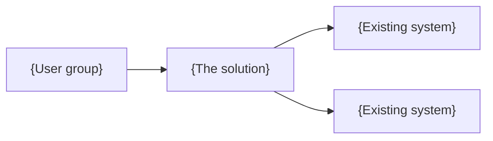
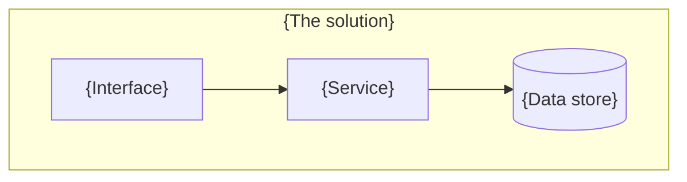

# {Solution name} — high level architecture

- **Version:** {0.1} · **Date:** {YYYY-MM-DD} · **Author:** {name}
- **Audience:** {architecture review board | delivery team | steering committee}
- **Status:** {Draft | For review | Approved}
- **Confidence:** {low | medium | high} — {the rule that produced it, in plain words}

> **Writing rule.** No product names, no framework vocabulary, no acronym the business
> does not already use. Building blocks are described by what they do. Any figure in this
> document either traces to supplied evidence or to a numbered assumption below.

## Scope and context

**Inside the boundary:** {what this architecture covers}

**Outside the boundary:** {what it explicitly does not, and who owns that}

{One paragraph on the situation that produced this: what exists today, what is changing,
and why now.}

## Drivers and constraints

**The one thing this must get right:** {dominant quality attribute, and what it means here}

**Must-have requirements:**

| # | Requirement | Why it is a must-have |
|---|---|---|
| R1 | {…} | {…} |

**Constraints that are genuinely fixed:**

| Constraint | Source | Effect on the architecture |
|---|---|---|
| {…} | {policy ID, contract, regulation, or "assumed — see A#"} | {…} |

*Distinguish fixed constraints from inherited habits. "We have always done it this way" is
not a constraint, and treating it as one is how an estate calcifies.*

## Options considered

| Option | In one sentence a non-specialist can picture |
|---|---|
| {opt-1} | {…} |
| {opt-2} | {…} |

{Two to four genuinely different options. If only one architecture is realistically
available, say so here and say why — that is a legitimate finding. Do not manufacture a
straw alternative.}

## Options eliminated, and by what

| Option | Eliminated by | What the constraint says |
|---|---|---|
| {opt-n} | {policy_id} | {the constraint as the organization states it} |

*State "No option was eliminated by constraint" explicitly if none was. A missing section
reads as a missing option.*

## Recommended architecture

**{opt-n} — {name}.**

{Two or three paragraphs. What it is, how it works, and the two or three things that made
it the recommendation — expressed as reasons, not as scores. The assessment is in the
option assessment artifact for anyone who wants the arithmetic.}

{If the top two options fell inside the indifference band, say so here instead: which two,
why they cannot be separated on this evidence, and the one piece of evidence that would
separate them.}

## Views

*Each view answers one stated question. Cut any view that answers none.*

### Context — who and what this interacts with

> Question this answers: *what sits outside the boundary, and what crosses it?*

{One paragraph. Name each actor and each external system, and say what crosses the line.}

### Containers — the major parts and what they hold

> Question this answers: *what are the deployable pieces, and where does the data live?*

{One paragraph per container: what it is responsible for, and what it must not do.}

### Integration — how data crosses the boundary

> Question this answers: *what talks to what, in which direction, how often, and what happens when it fails?*

| From | To | What moves | Pattern | Frequency | On failure |
|---|---|---|---|---|---|
| {…} | {…} | {…} | {synchronous API \| asynchronous event \| batch file} | {…} | {retry \| queue \| manual} |

*The "on failure" column is the one that gets skipped and the one operations will ask about first.*

### Deployment — where it runs

> Question this answers: *what has to be provisioned, and what is the recovery position?*

{Environments, hosting model, and what the recovery arrangement actually is — not what
would be nice.}

## How it meets the requirements

| # | Requirement | Delivered by | Notes |
|---|---|---|---|
| R1 | {…} | {the part of the architecture that delivers it} | {…} |

*Every must-have traced. An untraced requirement is one nobody notices is missing until testing.*

## Non-functional treatment

| Quality attribute | Target | Source | How the architecture meets it |
|---|---|---|---|
| Availability | {…} | {supplied \| **PROPOSED — confirm, see A#**} | {the mechanism, not the aspiration} |
| Performance | {…} | {…} | {…} |
| Recovery | {…} | {…} | {…} |
| Capacity and growth | {…} | {…} | {…} |
| Retention | {…} | {…} | {…} |

**Targets marked PROPOSED were derived, not supplied.** They are proposals for
confirmation and every decision resting on one is marked in the decision log.

## Integration approach

{The pattern being applied across the board and why — point-to-point, brokered, event
driven, or a stated mix. Where an existing integration constraint applies, name it.}

{Where the architecture adds to an existing brittle point rather than relieving it, say so.
That sentence is the difference between an architecture and a wish.}

## Security and data

**Data held or moved:** {entities and classification}

**Identity and access:** {…}

**Where the data sits, and where it may not go:** {…}

**Evidence the organization can produce:** {audit logging, retention, and what a reviewer
would be shown}

## Risks and mitigations

| # | Risk | Likelihood | Impact | Mitigation, or explicit acceptance |
|---|---|---|---|---|
| K1 | {…} | {low \| medium \| high} | {…} | {…} |

*An architecture with no risks listed has not been examined. Accepting a risk is a valid
answer; not naming it is not.*

## What we assumed

| # | Assumption | Why we had to assume it | What it affects |
|---|---|---|---|
| A1 | {…} | {the input that was not available} | {which decisions move if it is wrong} |

## How confident this is

**{low | medium | high}** — {the rule that produced this rating}.

{What would raise it, specifically. "Confirmed availability and recovery targets from the
business would move this to medium" is useful. "More information" is not.}

## What would change this architecture

- "At {N}× the current peak, {the part that gives way} becomes the constraint and would have to change first."
- "If the availability target is {stricter value} rather than the assumed {value}, {which decision reverses}."
- "An organization with less delivery capacity than this one would reach {the same | a different} recommendation."

## Deliberately not decided here

{Sourcing, product selection, detailed interface design, cost, sequencing — whichever
apply. This section is what stops a reader assuming silence means agreement.}

## Open questions

| # | Question | Who can answer it | Needed by |
|---|---|---|---|
| Q1 | {…} | {…} | {…} |
