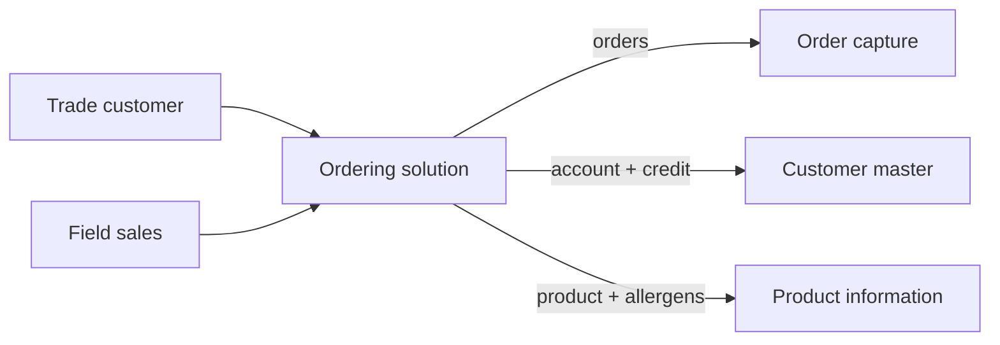
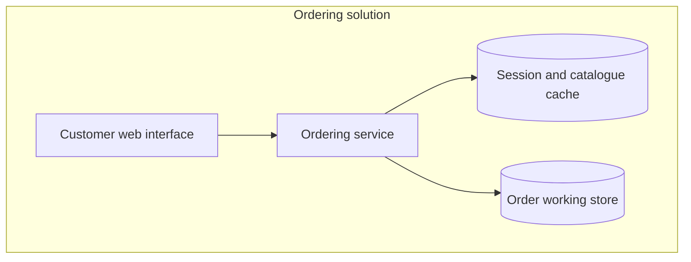

# Views — which ones, and how to draw them without a tool

Background, loaded on demand. **The method in [`SKILL.md`](../SKILL.md) is complete without this file.** Reach for it when a reviewer asks for a view you did not produce, or when a diagram is not landing.

## Four views, and the question each one answers

A view exists to answer a question a reviewer will ask. **A view that answers no question is decoration and should be cut** — including a handsome one.

| View | The question | Cut it when |
|---|---|---|
| **Context** | What sits outside the boundary, and what crosses it? | Never. This is the one that settles scope arguments |
| **Containers** | What are the deployable parts, and where does the data live? | Never, for a solution of any size |
| **Integration** | What talks to what, in which direction, how often, and what happens when it fails? | The solution genuinely touches nothing else — rare enough to be worth stating |
| **Deployment** | What has to be provisioned, and what is the recovery position? | Scope is a single application on existing infrastructure with no change to either |

More views than these is usually a sign that detailed design has started. Fewer is usually a sign the document will come back.

## Draw them in markdown

Hosts differ in whether they can produce image files. **Mermaid in a fenced block renders in most tools and reads as structured text everywhere else**, which keeps the document usable for an architect whose tool cannot draw. That is the whole reason the markdown floor exists.

Two rules that decide whether a diagram helps:

**Fifteen boxes is not a view, it is an inventory.** If the container view has more than about nine boxes, either the scope is wrong or two of them are the same thing. Group and redraw.

**Label the arrows.** An unlabelled arrow means "these are connected somehow", which the reader already assumed. `orders (async)` tells them something.

### Context

Every external box is a system or an actor that already exists. If a box on the context view is something this project also has to build, the scope boundary is wrong.

### Containers

One paragraph per container: what it is responsible for, and — more usefully — **what it must not do**. "The working store holds orders in flight only; the system of record remains order capture" prevents an entire class of future argument.

### Integration

A table beats a diagram here, because the columns a diagram cannot carry are the ones that matter:

| From | To | What moves | Pattern | Frequency | On failure |
|---|---|---|---|---|---|
| Ordering solution | Order capture | Submitted orders | Synchronous API | Real time | Queue and retry, customer sees "received" |
| Customer master | Ordering solution | Account, credit position | Asynchronous event | On change | Serve last known, flag staleness after 24h |

**The "on failure" column is the one that gets skipped and the first one operations asks about.** An integration table without it describes the happy path only, which is the path that never causes an incident.

### Deployment

Environments, hosting position, and the recovery arrangement **as it will actually be**, not as it would ideally be. "Backups are taken nightly and have never been restore-tested" is a more useful sentence than a recovery-time objective nobody has verified — and it belongs in the risk table as well.

## Notation

Use whatever notation the organization already reads. Where there is none, plain boxes and labelled arrows beat a formal notation the audience has to learn — this framework's users are frequently presenting to people who do not model.

**State the convention once, at the top of the views section**, in a line: solid arrow means synchronous, dashed means asynchronous, cylinder means a data store. Then hold to it. An inconsistent convention is worse than no convention, because the reader believes the difference means something.

## The failure this file exists to prevent

**A clean target architecture that quietly assumes somebody else fixes the thing in the middle.**

It is the characteristic failure of architecture documents, and it is invisible in a diagram — the fragile shared component looks exactly like the healthy ones. If the recommended architecture depends on an existing system being replaced, re-platformed, or made more reliable, that is a **dependency to state on the view and in the risk table**, not an assumption to bury in a box.

Where an option adds load to an existing brittle point rather than relieving it, the view should show it and the prose should say it. An architecture that is honest about what it makes worse is the one a review board can actually approve.
