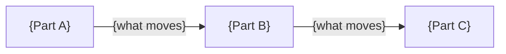

# {Pattern name — what it does, not what it uses}

> **Do not publish this document if the status is `not_yet_a_pattern`.** Produce the
> readiness assessment and the decision record instead. A polished pattern document for
> something that is one system's design is worse than no document, because it gets cited.

| | |
|---|---|
| **Status** | {mandated \| recommended \| proposed} |
| **Applies to** | {single domain \| multiple domains \| whole estate} — {which} |
| **Owner** | {name or role} |
| **Version / date** | {0.1} / {YYYY-MM-DD} |
| **Next review** | {YYYY-MM-DD} |
| **Confidence** | {low \| medium \| high} — {the rule that produced it} |
| **Implementations** | {n} |

*Status capped by a constraint? Say so here, with the policy ID. A reader who sees
`recommended` and does not know it was blocked from `mandated` will assume it was judged.*

## The problem

{The recurring problem, in terms a delivery team would recognize as theirs. Not the
solution. Not a technology. If you cannot write this without naming the solution, that is
a finding — say so rather than working around it.}

## Context and forces

{What makes this problem hard. The competing pressures a team feels — consistency against
speed, coupling against autonomy, cost against resilience. A pattern is a resolution of
forces; if there are no forces, there is no pattern, only a preference.}

## When to use it

{The conditions under which this is the right answer. Specific enough that a team can tell
whether they are in scope without asking you.}

## When NOT to use it

**Mandatory section.**

{Where this pattern does not apply, and — just as important — **what to do instead there**.}

{Patterns are discredited by misapplication far more often than by being wrong. Every
pattern that people came to dislike had a missing anti-scope and got applied somewhere it
never fitted.}

## The shape

{One paragraph per part: what it is responsible for, and — more usefully — **what it must
not do.**}

**This pattern forbids:**

- {"Consumers reading the producer's data store directly."}
- {"Synchronous calls in the fulfilment path."}

*A pattern that forbids nothing constrains nothing. If this list is empty, you have a
diagram.*

## Decisions this makes for you

| Decision | The pattern's answer | Why it is settled here |
|---|---|---|
| {…} | {…} | {…} |

*This table is the value proposition. It should read as the list of decision records
nobody has to write again.*

## Decisions left to you

| Decision | Why the pattern does not settle it |
|---|---|
| {…} | {…} |

*Every decision the pattern takes is one a team cannot take locally. Take only the ones
that need to be consistent.*

## Operating envelope

| | Assumes | Guarantees |
|---|---|---|
| Throughput | {…} | {…} |
| Latency | {…} | {…} |
| Availability | {…} | {…} |
| Data volume | {…} | {…} |

**Targets marked PROPOSED were derived, not stated.** They are proposals for confirmation,
and any team applying this pattern outside the stated envelope is outside the pattern.

## How to tell if a solution conforms

| # | Criterion | How a reviewer checks it |
|---|---|---|
| C1 | {…} | {the specific, observable check} |

*Checkable by someone who did not write the pattern. "Services should be loosely coupled"
is not a criterion — it is a wish. If it cannot be checked, rewrite it or drop it.*

## How this has gone wrong

| Where | What happened | What the pattern now says about it |
|---|---|---|
| {…} | {…} | {…} |

*A pattern with no failure modes listed has not been used enough to publish.*

## What it costs to follow

{Time, skills, infrastructure, and what a team gives up. Based on what the existing
implementations actually took, or marked as estimated.}

{Patterns are consistently cheaper to write than to follow. If this section is empty, the
adoption cost is unknown rather than zero.}

## Where it is already in use

| System | Since | What was different about it | Who to ask |
|---|---|---|---|
| {…} | {…} | {…} | {…} |

*The "what was different" column matters most: it is the evidence that the pattern
generalizes rather than describing one system twice.*

## Varying from it

{Under `conform_or_explain`: how a team records a deviation and who needs to see it.}

{Under `mandated`: how a waiver is requested, who grants it, and how long it lasts.}

{Under `adapt_freely`: say so plainly, and do not claim conformance criteria the pattern
cannot enforce.}

## Related and superseded

- **Supersedes:** {pattern or decision record}. *That record is marked superseded and left otherwise unchanged.*
- **Depends on:** {…}
- **Frequently used with:** {…}
- **Alternative to:** {…}, when {condition}
